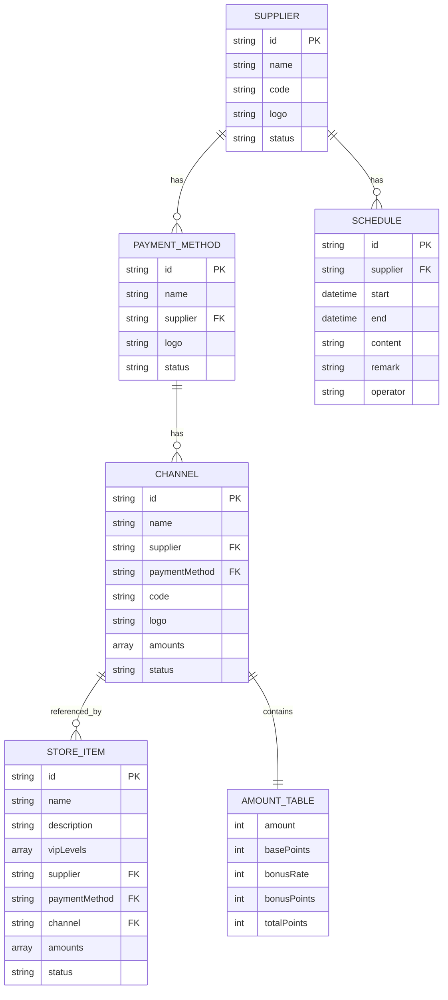

# Nova 三方支付設定流程

## 流程概述

```mermaid
graph TD
    A[開始] --> B[供應商管理]
    B --> C{選擇供應商}
    C --> D[新增/編輯供應商]
    D --> E[設定供應商基本資料]
    E --> F[供應商代碼/名稱/Logo]
    F --> G[儲存供應商]
    
    G --> H[支付方式管理]
    H --> I[新增支付方式]
    I --> J[選擇供應商]
    J --> K[設定支付方式名稱]
    K --> L[上傳支付方式 Logo]
    L --> M[設定啟用狀態]
    M --> N[儲存支付方式]
    
    N --> O[付款通道管理]
    O --> P[新增付款通道]
    P --> Q[選擇供應商]
    Q --> R[選擇支付方式]
    R --> S[設定通道名稱/代碼]
    S --> T[上傳通道 Logo]
    T --> U[設定儲值金額表]
    U --> V[金額/基本點數/贈比/贈點]
    V --> W[設定啟用狀態]
    W --> X[儲存付款通道]
    
    X --> Y[商城管理]
    Y --> Z[新增一般儲值項目]
    Z --> AA[設定項目名稱/說明]
    AA --> AB[選擇適用VIP等級]
    AB --> AC[選擇供應商]
    AC --> AD[選擇支付方式]
    AD --> AE[選擇付款通道]
    AE --> AF[繼承通道的儲值金額表]
    AF --> AG[設定啟用狀態]
    AG --> AH[儲存儲值項目]
    
    AH --> AI[維護排程管理]
    AI --> AJ[新增維護排程]
    AJ --> AK[選擇供應商]
    AK --> AL[設定維護時間範圍]
    AL --> AM[填寫維護說明]
    AM --> AN[儲存排程]
    
    AN --> AO[完成]
    
    style A fill:#e1f5e1
    style AO fill:#e1f5e1
    style B fill:#fff3cd
    style H fill:#fff3cd
    style O fill:#fff3cd
    style Y fill:#fff3cd
    style AI fill:#fff3cd
```



## 詳細步驟

### 1. 供應商管理

**目的**：建立支付服務供應商基本資料

**操作流程**：
1. 進入「三方支付管理」頁面
2. 在「供應商列表」區塊點擊「新增供應商」
3. 填寫表單：
   - 供應商名稱（必填）
   - 供應商代碼（必填，唯一識別碼）
   - Logo 圖片（選填）
   - 啟用狀態（toggle）
4. 點擊「確認新增」儲存

**資料結構**：
```javascript
{
  id: 'MYCARD01',
  name: 'MyCard',
  code: 'MYCARD01',
  logo: 'mycard_logo.png',
  status: 'on',
  paymentMethodCount: 3,
  channelCount: 3
}
```

---

### 2. 支付方式管理

**目的**：為供應商建立支付方式（如點數卡、電信帳單、線上轉點）

**前置條件**：必須先建立供應商

**操作流程**：
1. 點擊供應商卡片進入詳情
2. 切換到「支付方式」tab
3. 點擊「新增支付方式」
4. 填寫表單：
   - 供應商（自動帶入當前供應商）
   - 支付方式名稱（必填）
   - Logo 圖片（選填）
   - 啟用狀態（toggle）
5. 點擊「確認新增」儲存

**資料結構**：
```javascript
{
  id: 'pm_001',
  name: '點數卡',
  supplier: 'MYCARD01',
  logo: 'point_card.png',
  status: 'on'
}
```

---

### 3. 付款通道管理

**目的**：為支付方式建立具體的付款通道，並設定儲值金額表

**前置條件**：必須先建立供應商和支付方式

**操作流程**：
1. 在供應商詳情頁切換到「付款通道」tab
2. 點擊「新增付款通道」
3. 填寫表單：
   - 供應商（自動帶入）
   - 支付方式（下拉選擇）
   - 付款通道名稱（必填）
   - 付款通道代碼（選填）
   - Logo 圖片（選填）
   - 儲值金額表（必填）：
     - 點擊「+ 新增」按鈕新增金額檔位
     - 填寫：金額（台幣）、基本點數、贈比（%）
     - 系統自動計算：贈點 = floor(基本點數 × 贈比 / 100)
     - 系統自動計算：實際點數 = 基本點數 + 贈點
   - 啟用狀態（toggle）
4. 點擊「確認新增」儲存

**資料結構**：
```javascript
{
  id: 'ch_001',
  name: 'MyCard 點數卡通道 A',
  supplier: 'MYCARD01',
  paymentMethod: 'pm_001',
  code: 'MCA001',
  logo: 'channel_a.png',
  amounts: [
    { amount: 100, basePoints: 100, bonusRate: 10, bonusPoints: 10, totalPoints: 110 },
    { amount: 500, basePoints: 500, bonusRate: 15, bonusPoints: 75, totalPoints: 575 },
    { amount: 1000, basePoints: 1000, bonusRate: 20, bonusPoints: 200, totalPoints: 1200 }
  ],
  status: 'on'
}
```

**儲值金額表計算公式**：
- 贈點 = Math.floor(基本點數 × 贈比 / 100)
- 實際點數 = 基本點數 + 贈點

---

### 4. 商城管理（一般儲值）

**目的**：建立前台商城的儲值項目，供玩家選擇

**前置條件**：必須先建立完整的供應商 → 支付方式 → 付款通道鏈路

**操作流程**：
1. 進入「商城管理」頁面
2. 在「一般儲值」tab 點擊「新增一般儲值」
3. 填寫表單：
   - 項目名稱（必填）
   - 適用VIP等級（下拉多選）
   - 項目說明（選填）
   - 供應商（下拉選擇）
   - 支付方式（下拉選擇，依供應商篩選）
   - 付款通道（下拉選擇，依支付方式篩選）
   - 儲值金額表（自動繼承付款通道設定，唯讀顯示）
   - 啟用狀態（toggle）
4. 點擊「確認新增」儲存

**資料結構**：
```javascript
{
  id: 'store_001',
  name: 'MyCard 點數卡儲值',
  description: '使用 MyCard 點數卡進行儲值',
  vipLevels: ['VIP 1', 'VIP 2', 'VIP 3'],
  supplier: 'MYCARD01',
  paymentMethod: 'pm_001',
  channel: 'ch_001',
  amounts: [...], // 繼承自 ch_001.amounts
  status: 'on'
}
```

**重要規則**：
- 儲值金額表**不可編輯**，完全繼承付款通道設定
- 若需修改金額，必須回到「付款通道管理」修改
- 一個付款通道可被多個商城項目引用

---

### 5. 維護排程管理

**目的**：為供應商設定維護時間，維護期間該供應商的所有支付方式暫停服務

**操作流程**：
1. 在供應商列表下方的「維護排程」區塊
2. 點擊「+ 新增排程」
3. 填寫表單：
   - 供應商（下拉選擇，或從篩選器選擇）
   - 開始時間（日期時間選擇器）
   - 結束時間（日期時間選擇器）
   - 維護說明（必填）
   - 備註（選填）
4. 點擊「確認新增」儲存

**資料結構**：
```javascript
{
  id: 'sched_001',
  supplier: 'MYCARD01',
  start: '2026-05-14T03:00',
  end: '2026-05-14T05:00',
  content: '例行維護',
  remark: '系統升級',
  operator: 'admin'
}
```

**排程篩選器**：
- 預設顯示所有供應商的排程
- 可透過下拉選單篩選特定供應商
- 排程卡片顯示供應商名稱 + 時間範圍 + 說明

---

## 資料關聯圖



---

## 常見操作場景

### 場景 1：新增一個完整的支付鏈路

**步驟**：
1. 新增供應商「藍新金流」（代碼 NEWEBPAY01）
2. 為藍新金流新增支付方式「信用卡」
3. 為信用卡新增付款通道「VISA/Master 通道」
4. 設定儲值金額表：100元=110點、500元=575點、1000元=1200點
5. 在商城管理新增「藍新信用卡儲值」項目，選擇上述通道
6. 設定適用 VIP 1-3
7. 啟用項目

**結果**：前台商城出現「藍新信用卡儲值」選項，玩家可選擇 100/500/1000 元檔位

---

### 場景 2：修改儲值金額的贈點比例

**錯誤做法**：
- ❌ 在商城管理編輯儲值項目（金額表唯讀）

**正確做法**：
1. 進入「三方支付管理」
2. 找到對應供應商 → 付款通道 tab
3. 編輯該付款通道
4. 修改儲值金額表的贈比（如 10% → 15%）
5. 儲存後，所有引用該通道的商城項目自動更新

---

### 場景 3：供應商維護期間處理

**步驟**：
1. 在維護排程區塊新增排程
2. 選擇供應商「MyCard」
3. 設定維護時間 2026/5/14 03:00 ~ 05:00
4. 填寫說明「系統升級維護」
5. 儲存後，該時段內：
   - 前台商城隱藏所有 MyCard 相關儲值項目
   - 或顯示「維護中」標記

---

## 權限控制

| 角色 | 供應商管理 | 支付方式 | 付款通道 | 商城管理 | 維護排程 |
|------|-----------|---------|---------|---------|---------|
| 超級管理員 | ✓ 全部 | ✓ 全部 | ✓ 全部 | ✓ 全部 | ✓ 全部 |
| 財務主管 | ✓ 檢視/編輯 | ✓ 檢視/編輯 | ✓ 檢視/編輯 | ✓ 檢視/編輯 | ✓ 檢視/新增 |
| 客服人員 | ✓ 檢視 | ✓ 檢視 | ✓ 檢視 | ✓ 檢視 | ✓ 檢視 |

---

## 注意事項

1. **刪除限制**：
   - 有關聯支付方式的供應商無法刪除
   - 有關聯付款通道的支付方式無法刪除
   - 被商城項目引用的付款通道無法刪除

2. **停用影響**：
   - 停用供應商 → 該供應商所有支付方式/通道/商城項目自動停用
   - 停用支付方式 → 該方式下所有通道/商城項目自動停用
   - 停用付款通道 → 引用該通道的商城項目自動停用

3. **金額表繼承**：
   - 商城項目的金額表完全繼承付款通道
   - 修改通道金額表會影響所有引用該通道的商城項目
   - 建議：不同贈點策略使用不同付款通道

4. **維護排程**：
   - 排程時間可重疊（如多個供應商同時維護）
   - 過期排程自動歸檔到操作紀錄
   - 維護期間前台自動隱藏或標記維護中

---

## 檔案說明

- **Markdown 原始檔**：`docs/payment-flow.md`（可用任何文字編輯器編輯）
- **Mermaid 圖表**：使用 Mermaid 語法，可在 GitHub/GitLab/Obsidian/VS Code 等工具中渲染
- **匯出 PNG**：使用 [Mermaid Live Editor](https://mermaid.live/) 或 VS Code 外掛匯出圖片

---

生成時間：2026-05-12
版本：v1.0
